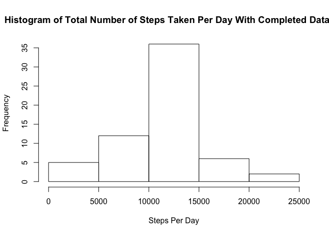

# Reproducible Research: Peer Assessment 1
Lina A. Colucci  
18 April 2016   

## Loading and preprocessing the data
1. Load the 3-column csv file into a data frame called 'data.'

```r
data <- read.csv('/Users/linacolucci/Documents/Coursera/reproducibleresearch/RepData_PeerAssessment1/activity.csv')
```
2. No additional transformation of the data was needed.  

## What is mean total number of steps taken per day?
1. Calculate the total number of steps taken per day

```r
totalPerDay <- sapply(split(data$steps, data$date),sum) #list of total steps taken per day
totalSteps <- sum(data$steps, na.rm=T)
```
The total number of steps taken is 570608. The total number of steps across all days is 570608.  

2. Here is a histogram of the total number of steps taken each day. 

```r
hist(totalPerDay,xlab='Steps Per Day', main='Histogram of Total Number of Steps Taken Per Day')
```


3. Calculate and report the mean and median of the total number of steps taken per day.  

```r
meanStepsPerDay <- mean(totalPerDay, na.rm=T)
medianStepsPerDay <- median(totalPerDay, na.rm=T)
options(scipen=1, digits=1) # Turns off scientific notation (i.e. exponential form)
```
The mean number of steps taken per day is 10766.2 and the median number is 10765.


## What is the average daily activity pattern?
1. Here is a time series plot of the 5-minute interval and the average number of steps taken, averaged across all days. 

```r
library(ggplot2)
library(data.table)
dataDT <- data.table(data)
byMinute <- dataDT[,mean(steps, na.rm = T),by=interval] # Average number of steps per interval of day
colnames(byMinute) <- c('interval', 'steps')
ggplot(byMinute, aes(interval, steps))+geom_line()+xlab('5 Minute Interval Throughout Day (from Midnight=0 to 11:59pm = 2359)')+
        ylab('Mean Number of Steps')+ggtitle('Mean Number of Steps Taken Throughout the Day Across Multiple Days')
```


## Imputing missing values
1. Calculate and report the total number of missing values. 

```r
naTotal = sum(is.na(data$steps))
```
The total number of missing steps is 2304.   

2-3. To fill in all these missing values I will fill them in with the mean from its respective 5-minute interval. 

```r
dataComplete <- data
dataComplete$steps <- ifelse(is.na(data$steps), byMinute$steps[match(data$interval, byMinute$interval)],data$steps) 
# Awesome tips/reference from: http://stackoverflow.com/questions/19593881/replace-na-values-in-dataframe-variable-with-values-from-other-dataframe-by-id
# If steps is 'NA', replace it from the byMinute steps array (match the intervals together). Otherwise, just use the data$steps value. 
```
The new dataset called 'dataComplete' is identifcal to the original dataset except with the missing values filled in as described above.   

4. Make a histogram of the total number of steps taken each day. Calculate and report the mean and median total number of steps taken per day. Do these values differ from the estimates from the first part of the assignment? What is the impact of imputing missing data on the estimates of the total daily number of steps?

```r
totalPerDayComplete <- sapply(split(dataComplete$steps, dataComplete$date),sum) #total steps taken per day
hist(totalPerDayComplete,xlab='Steps Per Day', main='Histogram of Total Number of Steps Taken Per Day With Completed Dataset')
```



```r
meanStepsPerDayComplete <- mean(totalPerDayComplete)
medianStepsPerDayComplete <- median(totalPerDayComplete)
```
The mean number of steps per day is 10766.2 and the median number is 10766.2. Adding the missing values had no impact on the mean number of steps and a slight increase in the median number of steps (from 10765 to 10766.2). The mean and median values are now identical after substituting in missing values.  

## Are there differences in activity patterns between weekdays and weekends?

1. Create a new factor variable in the dataset with two levels – “weekday” and “weekend” indicating whether a given date is a weekday or weekend day.

```r
library(chron)
dataComplete$day <- is.weekend(as.Date.character(data$date)) #FALSE = weekday, TRUE=weekend
```
A new column 'day' was added to the variable 'dataComplete.' A FALSE value for 'day' means the data is from a weekday. A TRUE value for 'day' means the data is from a weekend. 

2. Make a panel plot containing a time series plot 𝚕") of the 5-minute interval (x-axis) and the average number of steps taken, averaged across all weekday days or weekend days (y-axis). 

```r
dataCompleteDT <- data.table(dataComplete)
byMinuteCompleteWeekday <- dataCompleteDT[day==FALSE,mean(steps, na.rm = T),by=interval] 
byMinuteCompleteWeekend <- dataCompleteDT[day==TRUE,mean(steps, na.rm = T),by=interval] 
plotWeekday <- ggplot(byMinuteCompleteWeekday, aes(interval, V1))+geom_line()+labs(title="Weekday Data", x="Time of Day Interval",y="Average Number of Steps")
plotWeekend <- ggplot(byMinuteCompleteWeekend, aes(interval, V1))+geom_line()+labs(title="Weekend Data", x="Time of Day Interval",y="Average Number of Steps")
library(gridExtra)
```

```
## Warning: package 'gridExtra' was built under R version 3.2.4
```

```r
grid.arrange(plotWeekday, plotWeekend, ncol=1)
```


   
There is more activity throughout the day during the weekend as well as later into the night compared to weekday data. Both weekday and weekends have the largest number of steps between 9-10am.    


